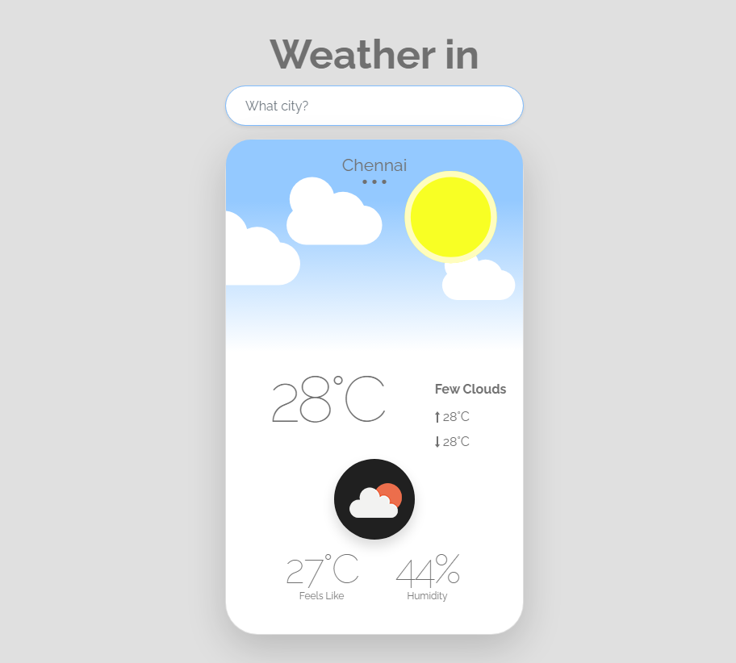

# Weather - App

> The weather app also provides atmospheric pressure, weather conditions, visibility distance, relative humidity, precipitation in different unites, dew point, wind speed and direction, in addition to ten days in future and hourly weather forecast..

It can fetch data using Open weather Api and it can locates your weather using this Api.

## Built With

- Html,Css,Js
- Webpack
- Vs-Code

## Live Demo

[Live Demo Link](https://karthykarthick.github.io/weather-app/)

## Getting Started

**This is an example of how you may give instructions on setting up your project locally.**
**Modify this file to match your project, remove sections that don't apply. For example: delete the testing section if the currect project doesn't require testing.**

To get a local copy up and running follow these simple example steps.

### Prerequisites

### Setup

### Install

### Usage

### Run tests

### Deployment

## Authors

👤 **Karthick**

- GitHub: [karthick](https://github.com/karthykarthick)

- LinkedIn: [karthick](https://linkedin.com/karthick-harimoorthy)

## 🤝 Contributing

Contributions, issues, and feature requests are welcome!

Feel free to check the [issues page](https://github.com/karthykarthick/weather-app/issues).

## Show your support

Give a ⭐️ if you like this project!

## Acknowledgments

- Hat tip to anyone whose code was used
- Inspiration
- etc

## 📝 License

This project is [MIT](lic.url) licensed.